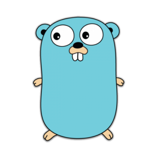
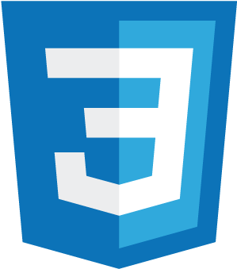

<h1>Kevin Zarama - kzarama</h1>

Software Engineering student at ICESI University and development intern at pragma.

---

- Working in Pragma.
- Learning web development.
- I’m looking to collaborate on all type of projeccts.
- Ask me about.

---

## Skills

 
 

 

 

---

## Contact

