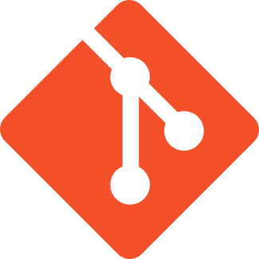

# Kevin Zarama - kzarama

Software Engineering student at ICESI University and development intern at pragma.

---

-   Working in Pragma.
-   Learning web development.
-   I’m looking to collaborate on all type of projeccts.
-   Ask me about.

---

## Skills

---

## Contact

